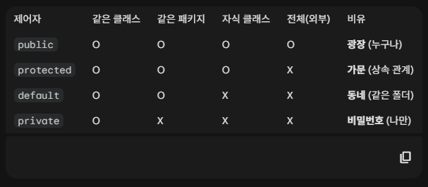

### 📚 정수
**🏷️ 보통 int를 사용한다**
- byte : -128 ~ 127
- short : -32,768 ~ 32,767
- int : -2,147,483,648 ~ 2,147,483,647
- long : -9,223,372,036,854,775,808 ~ 9,223,372,036,854,775,807
```java
int a = 2147483648; // X
long a = 2147483648 // O
int a = 2147483648L; // O
```
--- 
### 📚 실수
**🏷️ 보통 double을 사용한다**
- float : ±(1.40129846432481707e-45 ~ 3.40282346638528860e+38)
- double : ±(4.94065645841246544e-324d ~ 1.79769313486231570e+308d)
```java
float a = 2.2; // X
double a = 2.2; // O
float a = 2.2F; // O
```
---
### 📚 문자
**🏷️ 문자는 char**
- char a = '문';
---
### 📚 형 변환
**🏷️ 자동 형 변환**
- 표현범위가 좁은 데이터를 표현범위가 넓은 데이터 타입으로 자동 변환 해준다.
- byte → short / char → int → long → float → double
```java
// float타입의 3.0이 자동으로 double형으로 형 변환
double a = 3.0F;
int x = 10;
int y = 3; 
double z = 3.0
System.out.println(x/y) // 3
System.out.println(x/z) // 3.333..
``` 
**🏷️ 명시적 형 변환**
- (데이터 타입)데이터 값
```java
float a = 100.0 // X, 100.0은 double이기 때문에 float로 변환되지 않음
float a = (float)100.0; // O, 100.0은 double이지만 (float)로 인해 명시적 형 변환처리
```
---
### 📚 연산자
**🏷️ 산술 연산자**
- +, -, *, /, %

**🏷️ 단항 연산자**
- +, -, ++, --

**🏷️ 비교 연산자**
- ==, !=, >, <, >=, .equals()
```java
// .equals 예시
String a = "Hi";
String b = new String("Hi");
System.out.println(a == b); // false
System.out.println(a.equals(b)); // true
```
**🏷️ 논리 연산자**
- &&, ||, !
```java
true && true // true
true && false // false
false && true // false
false && false // false
true || true // true
true || false // true
false || true // false
false || false // false
!true // false
!false // true
```
---
### 📚 조건문
**🏷️ if else문**
```java
int a = 2;
if (a = 1) {
  System.out.println("a = 1");
} else if (a = 2) {
  System.out.println("a = 2");
} else {
  System.out.println("a = 3");
}
```
**🏷️ switch문**
```java
int a = 2
switch (a) {
  case 1:
    System.out.println("a = 1");
    break;
  case 2:
    System.out.println("a = 2");
    break;
  default:
    System.out.println("a = 0");
}
```
---
### 📚 반복문
**🏷️ while문**
- while문은 몇 번 반복할지 미리 알 수 없을때
```java
int a = 1;
while (a <= 5) {
  System.out.println(a++);
}
// 1, 2, 3, 4, 5
```
**🏷️ for문**
- for문은 몇 번 반복할지 미리 알 때
```java
int a;
for ( a = 1; a <= 5; a++ ) {
  System.out.println(a);
}
// 1, 2, 3, 4, 5
```
**🏷️ break 걸기**
- 반복문 내에서 break 거는 방법
```java
int a;
for ( a = 1; a <= 5; a++ ) {
  if( a == 3) break;
  System.out.println(a);
}
// 1, 2
```
**🏷️ continue 걸기**
- 반복문 내에서 특정 조건을 skip하고 다음 조건으로 넘어가는 방법
```java
int a;
for ( a = 1; a <= 5; a++ ) {
  if( a == 3) continue;
  System.out.println(a);
}
// 1, 2, 4, 5  (3은 continue에서 skip)
```
---
### 📚 배열 (★★★)
**🏷️ 배열을 생성하는 2가지 방법**
- String[] people = new String[2];
- String[] animals = {"dog","cat","mouse","bird"};
```java
String[] people = new String[2]; // ["",""]
people[0] = "kim"; people[1] = "lee"; // ["kim","lee"]
people.length; // 2
for (int a = 0; a < people.length ; a++) {
  System.out.println(people[a]);
}
// kim, lee

String[] animals = {"dog","cat","mouse","bird"}; // ["dog","cat","mouse","bird"]
System.out.println(animals[0]); // dog
System.out.println(animals[1]); // cat
System.out.println(animals[2]); // mouse 
System.out.println(animals[3]); // bird
animals.length; // 4

// forEach문
for (String animal : animals) {
  System.out.println(animal);
}
// "dog","cat","mouse","bird" 
```
---
### 📚 메소드 (★★★)
**🏷️ 메소드 = 함수**
- 메소드를 사용하면 코드의 재활용이 용이해지면서 코드량이 줄어들고, 유지보수에도 유리하다.
1. public static void 메소드
```java
public class Hello {
  public static void sayHello(String name) {
    System.out.println(name + "님 안녕하세요." );
  }
}

public class Main {
  public static void main(String[] args) {
    // Hello 메소드는 public static void이다.
    // 1. public이라서 Main class에서 호출이 가능하다.
    // 2. static이라서 `Hello hello = new Hello()` 처럼 객체를 만들 필요가 없음
    // 3. void라서 리턴값이 없다.
    Hello.sayHello("지용");
    // "지용님 안녕하세요."
  }
}
```
2. public static int(String) 메소드
```java
public class Add {
  public static int add(int a, int b) {
    int output = a + b;
    return output;
    // return a+b;
  }
}

public class Main {
  public static void main(String[] args) {
    // Add 메소드는 int 값을 반환하는 public static int이다.
    // 1. public이라서 Main class에서 호출이 가능하다.
    // 2. static이라서 `Add add = new Add()` 처럼 객체를 만들 필요가 없음
    // 3. void가 아닌 int라서 리턴값이 int이다.
    int result = Add.add(3,5);
    System.out.println(result) // 8 
  }
}
```
---
### 📚 클래스와 인스턴스, 객체
**🏷️ 메소드 = 함수**
- 클래스는 설계도(정의)  
- 인스턴스는 제품(호출)  
- 클래스에서 인스턴스에 접근 x  
- 인스턴스에서 클래스에 접근 O  
- 클래스메소드에서 클래스변수에 접근 O  
- 클래스메소드에서 인스턴스변수에 접근 X  
- 인스턴스변수에서 클래스변수에 접근 O  
- 인스턴스변수에서 인스턴스변수에 접근 O  
```java
class Smartphone {
  static String brand = "SAMSUNG";  // 클래스 변수
  String color;  // 인스턴스 변수

  static void staticPrint() {
    System.out.println(brand);  // 클래스메소드 → 클래스변수 접근 O
    // System.out.println(color);  // 클래스메소드 → 인스턴스변수 접근 X
  }
  void instancePrint() {
    System.out.println(brand);   // 인스턴스메소드 → 클래스변수 접근 O
    System.out.println(color);  // 인스턴스메소드 → 인스턴스변수 접근 O
  }
}

public class Main {
  public static void main(String[] args) {
    // Smartphone.color = "Red";  // 클래스 → 인스턴스변수 접근 X
    Smartphone myPhone = new Smartphone();
    myPhone.color = "White";  // 인스턴스 → 인스턴스변수 접근 O

    myPhone.staticPrint();   // 인스턴스 → 클래스메소드 호출 O
    myPhone.instancePrint();   // 인스턴스 → 인스턴스메소드 호출 O
    Smartphone.staticPrint();  // 클래스 → 클래스메소드 호출 O
    // Smartphone.instancePrint();  // 클래스 → 인스턴스메소드 호출 X
  }
}
```
---
### 📚 스코프와 THIS
**🏷️ this는 instance 그 자체를 가리킨다.**
```java
class Student {
  String name = "전지용"; // 인스턴스 변수

  void sayHello(String name) { // 지역 변수 (매개변수)
    System.out.println("Hello, " + this.name);  // this는 인스턴스를 가리킨다.
    System.out.println("Hello, " + name); 
  }
}

public class Main {
  public static void main(String[] args) {
    Student student = new Student();
    student.sayHello("한로로");
    // "Hello, 전지용"
    // "Hello, 한로로"
  }
}
```
---
### 📚 생성자
**🏷️ 생성자는 instance가 생성될 때, 가장 먼저 호출되는 메서드이다.**
- 생성자의 이름은 클래스 이름과 똑같아야한다.
- return이 없고, void도 쓰지 않는다.
- 자동으로 딱 한번 실행된다.(instance가 생성될 때)
- 생성자가 명시되어 있지 않아도 java가 기본생성자를 만들어준다.
```java
class Student {
  String name; 

  // 생성자 구문
  public Student(){} // parameter있는 생성자와 parameter없는 생성자를 동시에 쓸 수도 있다.
  public Student(String name) { 
      this.name = name; // parameter의 name을 인스턴스 변수에 저장
  }
  
  public void sayHello() {
      System.out.println("제 이름은 " + this.name + "입니다.");
  }
}

public class Main {
  public static void main(String[] args) {
    Student s1 = new Student("전지용"); // argument로 "전지용"을 전달
    Student s2 = new Student("한로로"); // argument로 "한로로"를 전달

    s1.sayHello(); // 제 이름은 전지용입니다.
    s2.sayHello(); // 제 이름은 한로로입니다.
  }
}
```
---
### 📚상속 
**🏷️ 부모클래스 멤버를 자식클래스가 물려받아 사용할 수 있는것(extneds,super,sub,override,overloading)**
- 상속을 사용하는 이유 : 코드의 재사용, 유지보수 관리, 다형성
- 부모의 메소드를 자식 메소드에서 재정의하고 싶을땐 `@Override`를 사용한다. (생략가능)
- Override : 부모의 메소드를 자식클래스에서 재정의 하는것.
- Overloading : 같은 클래스 내부에서 같은 이름의 메서드를 여러개 만드는것. (parameter의 타입이나 개수가 다르다)
```java
// 부모 클래스 (Super Class)
class Phone {
  private String model; // 인스턴스 변수

  public Phone(){}
  public Phone(String model) {  // 생성자
    this.model = model;
  }
  public void call() {  // 인스턴스 메소드
    System.out.println("calling...");
  }
}

// 자식 클래스 (Sub Class)
class Galaxy extends Phone { 
  int price;  // 인스턴스 변수

  Galaxy(String model, int price) {  // 생성자
    super(model); // 부모의 생성자에 parameter를 전달
    this.price = price;
  }

  // 메소드 오버라이딩 (부모의 기능을 재정의)
  @Override 
  void call() {
    System.out.println("calling with Galaxy...");
  }
  // 자식클래스 메소드 추가
  void samsungPay() { 
    System.out.println("Run SamsungPay App...");
  }
}

public class Main {
    public static void main(String[] args) {
        Galaxy myPhone = new Galaxy("S25 Ultra", 1500000);

        System.out.println("모델명: " + myPhone.model); // 부모에게 물려받은 변수 사용
        myPhone.call();     // 'calling with Galaxy...'
        myPhone.samsungPay();  // 'Run SamsungPay App...'
    }
}
```
---
### 📚 클래스 패스(Class Path)
**🏷️ 클래스 패스 정의**
- JVM이 애플리케이션을 실행할 때, 필요한 클래스 파일(.class)을 찾기 위해 참고하는 경로의 목록 (기본값: 현재경로)  

**🏷️ 클래스 패스 지정하기**
- 클래스 파일들이 여러 폴더에 분산되어 있을 때, 자바에게 탐색 위치를 알려주는 옵션   
('94. 클래스와 경로의 관계' 영상 참고)
```java
// MainClassName.class 파일이 현재경로의 lib폴더안에 존재할 때
java -classpath ".;lib" MainClassName
```

**🏷️ 환경변수**

---
### 📚 패키지
**🏷️import로 다른 패키지의 클래스 사용하기**
- import 패키지경로.클래스명 으로 다른 패키지의 클래스를 가져올 수 있다.
```java
// 파일경로: src/first/second/third/Calculator.java
package first.second.third;

public class Calculator {
    public int plus(int a, int b) {
        return a + b;
    }
}

-----------------------------------------------------------

// 파일경로: src/first/second/fourth/Main.java
package first.second.fourth;
import first.second.third.Calculator; // 불러올 클래스의 패키지경로를 작성
// 만약 third 패키지의 모든 클래스를 가져오고 싶다면: 
// first.second.third.*;

public class Main {
  public static void main(String[] args) {
    Calculator cal = new Calculator();
     
    int result = cal.plus(10, 20);
    System.out.println("결과: " + result);
  }
}
```
---
### 📚 접근 제어자
**🏷️public, private**
- public은 같은 클래스, 같은 패키지, 자식 클래스, 그 외 다 접근할 수 있다.
- protected는 같은 클래스, 같은 패키지, 자식 클래스에서만 접근할 수 았다.
- default는 같은 클래스, 같은 패키지에서만 접근할 수 있다.
- private는 같은 클래스에서만 접근할 수

```java
// 📂 java/main/main.class
class Test {
  public String a() {
    return "public a()";
  }
  private String b() {
    return "private b()";
  }
  public String c() {
    System.out.println("public c()");
    return b();
  }
}

public class Main {
  public static void main (String[] args) {
    Test test = new Test();
    System.out.println(test.a()); // "public a()"
    System.out.println(test.b()); // error!
    System.out.println(test.c()); // "public c()" "public b()"
  }
}

// 📂 java/sub/sub.class
public class Main {
  public static void main (String[] args) {
    Test test = new Test();
    System.out.println(test.a()); // "public a()"
    System.out.println(test.b()); // error!
    System.out.println(test.c()); // "public c()" "public b()"
  }
}
```
---
### 📚 추상 클래스 (abstract)
**🏷️ 추상 메소드와 추상 클래스**
- 추상 메소드를 포함하고 있는 클래스를 추상 클래스라고 한다.
- 추상 메소드는 실행문이 없고 정의만 되어있다.
- 추상 클래스 내부에 일반 메소드가 있어도 상관없다.
- 추상 클래스는 직접 인스턴스를 생성할 수 없다.
- 추상 클래스는 상속을 강제하기 위한 것. 그래서 부모 클래스엔 메소드를 정의만 해놓고 실행문은 자식 클래스에게 위임한다.
```java
// class A는 추상메소드 b를 포함하고 있기에 추상 클래스가 된다.
abstract class A {
  public abstract int b(); // 추상 메소드 정의
  // public abstract int c(){System.out.println("c();")}; 
  // error! 추상 메소드는 실행문이 없다.
  public void d(){
    // 추상 클래스 내부에 일반 메소드가 존재할 수 있다.
    System.out.println("d();");
  }
}

public class B extends A {
  // A 클래스의 추상 메소드 b()를 상속받아 재정의(Override)
  @Override
  public int b(){
    System.out.println("b();");
    return 1;
  }
}

public class Main {
  public static void main(String[] args){
    // A obj = new A();  추상 클래스는 직접 인스턴스 생성 불가
    B obj = new B();
    obj.b(); // b();
    obj.d(); // d();
  }
}
```
---
### 📚 final (상수화)
**🏷️ final은 마치 javascript의 const와 유사하다.**
- final 변수 → 값 변경 금지
- final 메소드 → 재정의(override) 금지
- final 클래스 → 상속 금지
```java
// final 변수
final String url = "https://naver.com"; 
public static final int SITE_URL = "https://naver.com";  // public static final은 대문자와 언더바를 사용

// final 메소드
public final void print(){
  System.out.println("출력완료");
}
public final int one(){
  return 1;
}

// final 클래스
public final class One {
  ...
}
```
---
### 📚 인터페이스(interface, implements)
**🏷️인터페이스를 상속받은 클래스는 인터페이스의 메소드 사용을 강제한다.**
- 클래스에 인터페이스를 상속시킬 땐 implements를 사용한다.
- interface에는 몇가지 규칙이 있다.  
  1. interface내부의 멤버들은 public이어야 한다.  
  2. 하나의 클래스는 여러개의 interface를 구현할 수 있다. `implements I1,I2`
  3. interface에 다른 interface를 상속할 수 있다. `interface I1 extends I2 {}` 
```java
// 1. 인터페이스 선언 (규격 만들기)
interface RemoteControl {
  void turnOn();  
  void turnOff();
}

// 2. 인터페이스 구현 (implements)
class SamsungTV implements RemoteControl {
  @Override
  public void turnOn() {
    System.out.println("삼성 TV를 켭니다.");
  }
  @Override
  public void turnOff() {
    System.out.println("삼성 TV를 끕니다.");
  }
}
// 3. 인터페이스 구현 (implements)
class LgTV implements RemoteControl {
  @Override
  public void turnOn() {
    System.out.println("LG TV의 전원이 켜집니다.");
  }
  @Override
  public void turnOff() {
    System.out.println("LG TV의 전원이 꺼집니다.");
  }
}
```
---
### 📚 다형성
**🏷️다형성은 하나의 객체가 여러가지 형태를 가질 수 있는 성질이다.**
```java
// 메소드와 다형성
// 한 클래스 내에서 동일한 메소드의 parameter 타입이나 개수를 다르게하여 여러 형태를 가질 수 있음
class Obj {
  public void a(int param){
    System.out.println("int");
    System.out.println(param);
  }
  public void a(String param){
    System.out.println("string");
    System.out.println(param);
  }
}

public class Main {
  public static void main(String[] args){
    Obj obj = new Obj();
    obj.a(100);
    obj.a("100");
  }
}

// 클래스와 다형성
// 클래스의 데이터타입은 사용가능한 멤버의 범위를 결정하고
// 인스턴스가 생성될때는 생성자의 로직을 따른다.
class A {
  public String x(){ return "A.x"; }
}
class B extends A {
  @Override
  public String x(){ return "B.x"; }
  public String y(){ return "y"; }
}
public class Main {
  public static void main(String[] args){
    // 1. 클래스 B의 생성자로 인스턴스를 생성
    // 2. 생성된 인스턴스를 obj변수에 담고 데이터 타입을 클래스 A로 지정
    // 3. obj는 클래스 A,B의 공통 멤버만을 참조할 수 있다.
    A obj = new B();
    System.out.println(obj.x());  // "B.x", x()가 override 되었기때문
    // System.out.println(obj.y());  →  에러발생!
  }
}
------------------------------------------------------------------
class C extends A {
  public String x(){ return "C.x";}
}

public class Main2 {
  public static void main(String[] args){
    A obj = new B();
    A obj2 = new C();
    System.out.println(obj.x());  // "B.x"
    System.out.println(obj2.x());  // "C.x"
    // B,C 클래스에 x()가 override 되지 않았다면 "A.x"가 나왔을 것이다.
  }
}


// 인터페이스와 다형성
interface I1 {
  public String A();
}
interface I2 {
  public String B();
}
class D implements I1,I2 {
  public String A() {
    return "A";
  }
  public String B() {
    return "B";
  }
}
public class Main {
  public static void main (String[] args){
    D obj = new D();
    I1 obj2 = new D();
    I2 obj3 = new D();

    obj.A();  // "A" 
    obj.B();  // "B"

    obj2.A();  // "A"
    obj2.B();  // error!

    obj3.A();  // error!
    obj3.B();  // "B"
  }
}

// Kim과 Lee는 부부다. 
// Kim은 아빠, 프로그래머, 기독교이다.
// Lee는 엄마, 프로그래머이다.
interface father {}
interface mother {}
interface programmer {
  public void coding();
}
interface christian {}

class Kim implements father, programmer, christian {
  public void coding() {
    System.out.println("프론트엔드 개발자");
  }
}
class Lee implements mother, programmer {
  public void coding() {
    System.out.println("백엔드 개발자");
  }
}
public class Company {
  public static void main(String[] args) {
    programmer worker1 = new Kim();
    programmer worker2 = new Lee();

    worker1.coding();  // "프론트엔드 개발자"
    worker2.coding();  // "백엔드 개발자"
  }
}
```
---
### 📚 예외처리 (try catch, finally, throw )
**🏷️try catch 사용법** 
- try { 실행문 } catch(에러타입 e1, 에러타입 e2...){ 예외처리 }
- e. getMessage() : error 메시지 전달
- e. toString() : error 타입 + 메시지 전달
- e. toString() : error 라인 + 타입 + 메시지 전달
- 예외처리 시 `catch(Exception e)`는 다른 error타입보다 나중에 작성되어야 한다.

**🏷️finally 사용법** 
- finally는 예외 여부와 관계없이 db연결 종료, 파일 닫기 등 '뒷정리' 작업을 할 때 쓰인다.

**🏷️ throws 사용법 (아래 예시2참조)**
- 예시2를 예시3으로 바꿀 수 있다. (throws를 사용하는 방법만 참고할것, 예시자체는 바른 예시가 아님)
- 예시4처럼 throw new로 에러를 커스텀 할 수 있다.
```java
// 예시 1
class A {
  private int[] arr = new int[3];
  A(){
    arr[0]=0;
    arr[1]=10;
    arr[2]=20;
  }
  public void z(int first, int second){
    try {
      System.out.println("실행문 실행 ");  // 실행
      System.out.println(arr[first] / arr[second]);  // error발생!
      System.out.println("실행문 실행 완료!");  // 미실행
    } catch(ArithmeticException e) {
      // 
      // error 메시지 전달
      System.out.println("\n e.getMessage() : \n" + e.getMessage());  
      // error 타입 + 메시지 전달
      System.out.println("\n e.toString() : \n" + e.toString()); 
      // error 라인 + 타입 + 메시지 전달
      System.out.println("\n e.printStackTrace() : \n" );
      e.printStackTrace();
    } catch(ArrayIndexOutOfBoundsException e) {
      // paramter의 수량이 안맞을때
      System.out.println("\n e.getMessage() : \n" + e.getMessage());  
      System.out.println("\n e.toString() : \n" + e.toString()); 
      System.out.println("\n e.printStackTrace() : \n" );
      e.printStackTrace();  
    } catch(Exception e) {
      // 그 외 다른 에러 발생 시 필터
       System.out.println("\n e.getMessage() : \n" + e.getMessage());  
      System.out.println("\n e.toString() : \n" + e.toString()); 
      System.out.println("\n e.printStackTrace() : \n" );
      e.printStackTrace();
    }
    finally {
      // 예외 여부와 관계없이 무조건 실행되는 로직
    }
    System.out.println("divide 메서드 종료"); // 마지막 실행
  }
}
public class Main {
  public static void main(String[] args) {
    A a = new A();
    a.z(10,1);
  }
}

---------------------------------------------------------------------
// 예시 2
import java.io.BufferedReader;
import java.io.FileNotFoundException;
import java.io.FileReader;
import java.io.IOException;

class B {
  void run() {
    BufferedReader br = null;
    String input = null;
    try {
      br = new BufferedReader(new FileReader("out.txt"));
    } catch (FileNotFoundException e) {
      // FileReader 자체에서 나오는 에러를 처리
      e.printStackTrace();
    }
    try {
      input = br.readLine();  // readLine은?
    } catch(IOException e) {
      // readLine 자체에서 나오는 에러를 처리
      e.printStackTrace();
    }
    System.out.println(input)
  }
}

// 예시3
class B {
  // b.run()의 사용자는 FileNotFoundException, IOException 에러처리를 강제받는다.
  void run() throws FileNotFoundException, IOException {
    BufferedReader br = null;
    String input = null;
    br = new BufferedReader(new FileReader("out.txt"));
    input = br.readLine();
    System.out.println(input)
  }
}
class C {
  void run() throws FileNotFoundException, IOException {
    B b = new B();
    b.run();
  }
}
public class Main {
  public static void main(String[] args) {
    C c = new C();
    try {
      c.run();
    } catch (FileNotFoundException e) {
      // FileNotFoundException은 IOException을 상속 받기때문에 생략해도 상관없긴함.
      e.printStackTrace();
    } catch (IOException e) {
      e.printStackTrace();
    }
  }
}

----------------------------------------------------------------
//예시 4
class A {
  int left, right;
  public void setLR(int left, int right) {
    this.left = left;
    this.right = right;
  }

  public void divide() {
    if(right == 0) {
      // 에러 커스텀
      throw new ArithmeticException("0으로 나눌 수 없다.");
    }
    try { 
      System.out.println("계산결과는")
      System.out.println(this.left / this.right);
    } catch(Exception e) {
      e.printStackTrace();
    }
  }
}

public class Main {
  public static void main(String[] args) {
    A a = new a();
    a.setLR(10,0);
    try {
      a.divide();
    } catch(Exception e) {
      System.out.println(e.getMessage());  // 0으로 나눌 수 없다.
    }
  }
}
```
---
### 📚 Object Class
**🏷️Object Class란?**
- Object Class는 모든 클래스의 조상이다.
- Object Class에는 많은 메소드들이 존재하고,  
  모든 클래스는 Object Class를 상속받기에 Object Class의 메소드를 사용할 수 있다.
```java
class O {} // `class O extends Object {}` 와 같다. 
O.toString() // toString()은 대표적인 Object Class의 메소드다. 
```
---
### 📚 상수 (enum)
**🏷️상수들의 집합**
- enum Fruit { APPLE, BANANA, PEACH }
```java
enum Fruit {
  APPLE("RED"), PEACH("PINK"), BANANA("YELLOW");
  private String color;
  public String getColor(){
    return this.color;
  }
  Fruit(String color) {
    System.out.println("Call Contstructor" + this);
    this.color = color;
  }
}

public class Main {
  public static void main(String[] args) {
    Fruit type = Fruit.APPLE;

    for(Fruit fruit : Fruit.values()){
      System.out.println("fruit is " + fruit);
    }
    switch(type) {
      case APPLE:
        System.out.println(57 + "kcal, color is " + FRUIT.APPLE.getColor());
        break;
        case PEACH:
        System.out.println(34 + "kcal, color is " + FRUIT.PEACH.getColor());
        break;
        case BANANA:
        System.out.println(93 + "kcal, color is " + FRUIT.BANANA.getColor());
        break;
    }
  }
}

```
---


